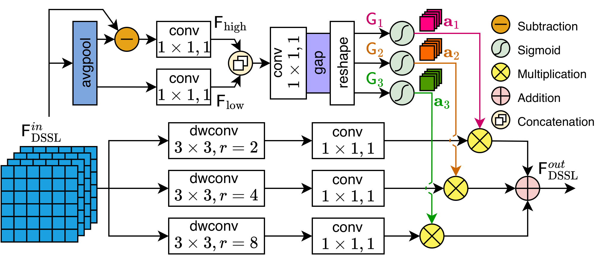

# ASTRA-Net

The evolution of wireless communications toward fifth-generation (5G) is driving unprecedented spectral congestion, forcing cellular technologies like long-term evolution (LTE) and 5G into frequency bands traditionally occupied by incumbent radar systems. This convergence creates a critical need for intelligent spectrum sensing (SS). In this work, we introduce ASTRA-Net, an advanced SS method for radar and next-generation wireless networks, featuring an innovative multi-stage encoder-decoder architecture that integrates a dynamic receptive field mechanism. This innovative model is designed to precisely segment 5G, LTE and radar signals by identifying the spectral content based on the frequency and time occupied by the signals. ASTRA-Net facilitates an effective extraction of both local and global spectral features, enabling robust analysis of wideband spectrograms under diverse signal and challenging channel conditions. The experimental results highlight the efficiency and effectiveness of ASTRA-Net: with a compact architecture of only 6.6M parameters, it achieves a state-of-the-art global accuracy of 98.33% and a mean intersection-over-union (IoU) of 96.97%. These results demonstrate ASTRA-Net as a highly competitive and practical solution for real-time SS in next-generation wireless systems.

<p align="center">
  
</p>

<p align="center">
  
</p>

## Dataset
The dataset can be downloaded on [Google Drive](https://drive.google.com/drive/folders/12Z1p1CG3lIk3IjHZt3Ej7AUZn2vJOcOV?usp=sharing) (please report if not available).

## Citation
If you find this work or dataset useful for your research, please cite our paper:

```bibtex
@ARTICLE{11397655,
  author={Huynh, Phuoc-Long and Phan, Van-Ca and Pham, Quoc-Viet and da Costa, Daniel Benevides and Huynh-The, Thien},
  journal={IEEE Wireless Communications Letters}, 
  title={ASTRA-Net: Adaptive Spectro-Temporal Robust Architecture for Spectrum Sensing}, 
  year={2026},
  volume={15},
  number={},
  pages={1926-1930},
  month={Feb.}
}
If there is any error or need to be discussed, please email to [Phuoc-Long Huynh](https://github.com/Phuoc-LongHuynh) via hphuoclong24@gmail.com.


